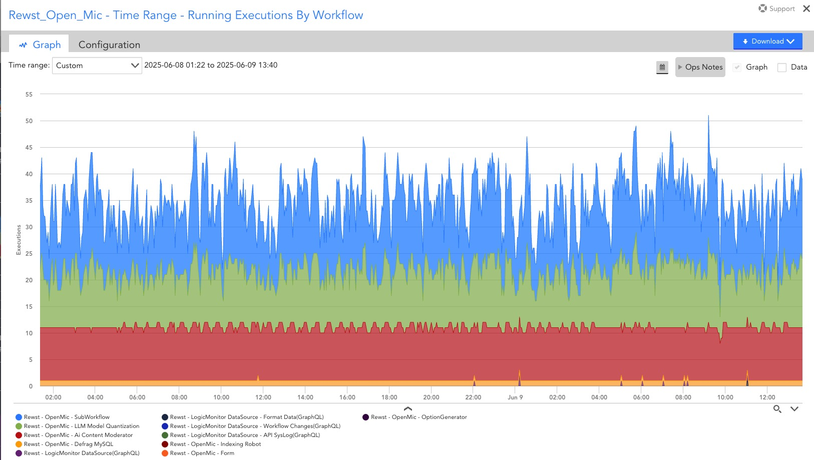
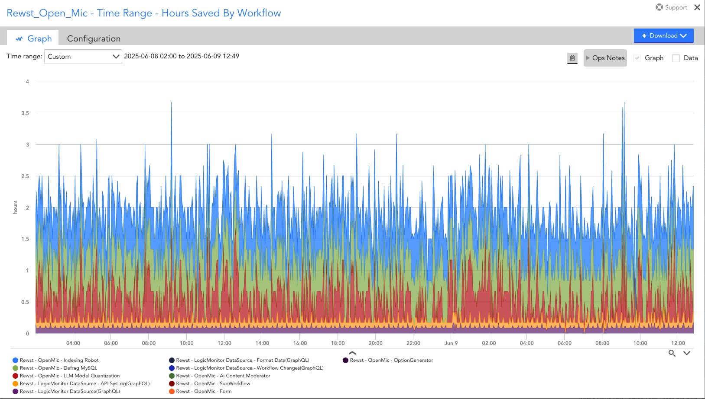
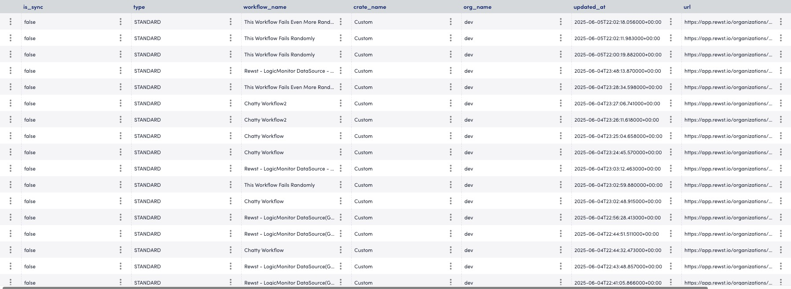
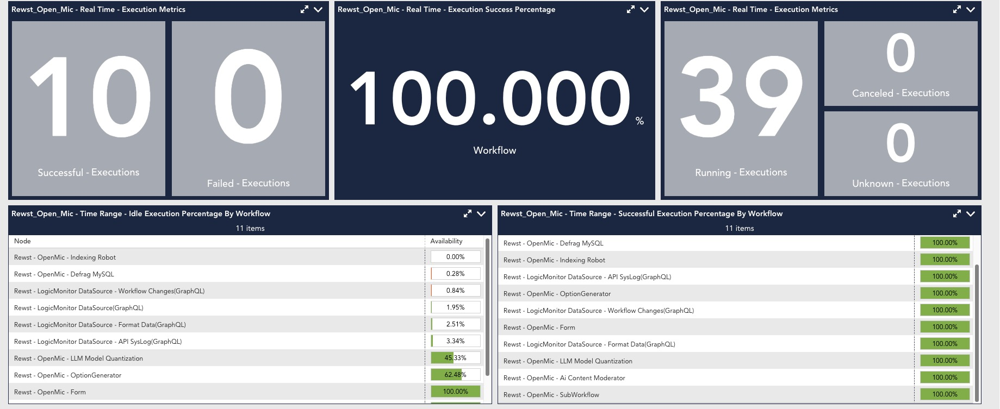
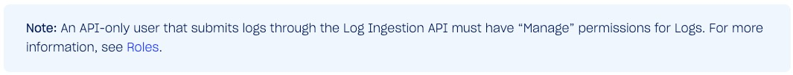
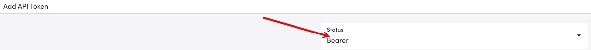
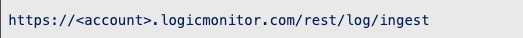
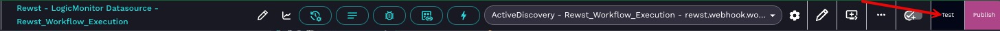
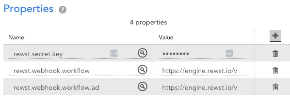
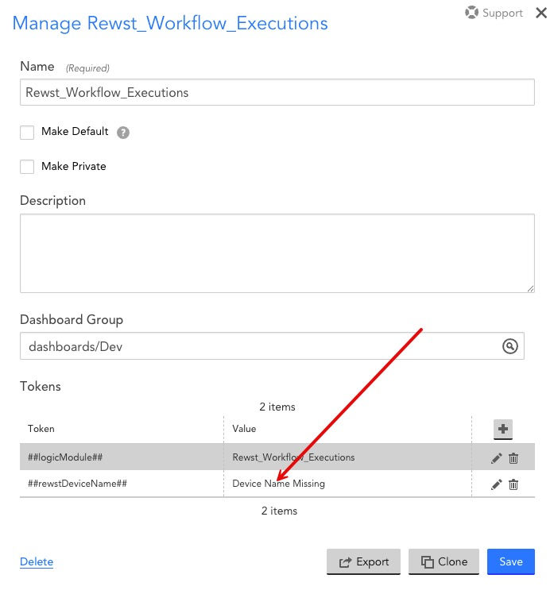

# Rewst_Workflow_Executions

### LogicMonitor Datasource LogicModule - Rewst_Workflow_Executions
```
    Rewst - LogicMonitor Datasource - Rewst_Workflow_Execution
    Rewst - LogicMonitor Datasource - JSON Coop
    Rewst - LogicMonitor Datasource - Workflow Configuration Drift
    Rewst - LogicMonitor Datasource - LmLogs Request
```




### Workflow Execution Syslog - LogicMonitor LM Logs Syslog (API)
```
    Rewst - LogicMonitor LmLogs - Workflow Syslog
```

---
* ### Requirements
    - LogicMonitor
    - LM Logs (Optional)
    - Rewst GraphQL Task (Beta)

>
> Contact Rewst support for access to Rewst GraphQL Task (Beta)
>

----

## Installation & Configuration

1. LogicMonitor - Import LogicModule "Rewst_Workflow_Executions" - [LogicMonitor_Datasource.json](https://github.com/nikolazleo/Rewst_Workflow_Executions/blob/main/LogicMonitor_Datasource.json)
    - LogicMonitor -> Modules -> My Module ToolBox -> Add -> Import From File

2. LogicMonitor - Create API-Only User
    - **Create and Document API Token Type=Bearer**





3. Rewst - Import Workflows - [Rewst_Workflow_Bundle.json](https://github.com/nikolazleo/Rewst_Workflow_Executions/blob/main/Rewst_Workflow_Bundle.json)
    - Rewst -> Automations -> Workflows -> Import Bundle

4. Rewst - Create Rewst Org Variables

| UseAsDefault | Type   | Org Variable Key                                      | Org Variable Value                                                   |
|--------------|--------|------------------------------------------|---------------------------------------------------------|
| false        | secret | logicmonitor_datasource_trigger_secret   | thisisatest                                             |
| false        | general| logicmonitor_datasource_device_id        | app.rewst.io's system.deviceId in LogicMonitor         |
| false        | general| logicmonitor_datasource_account          |                                           |
| false        | secret | logicmonitor_datasource_bearer_token     | Step 2 Token Type=Bearer                                |

**logicmonitor_datasource_account value is only the < account > value. Not the full URL**


5. Rewst - Document Trigger Webhook's & Set Trigger Secret Key
    - workflow="Rewst - LogicMonitor Datasource - Rewst_Workflow_Execution".
        - Trigger Webhook = "ActiveDiscovery - Rewst_Workflow_Execution - rewst.webhook.workflow.ad"
        - Trigger Webhook = "Collector - Rewst_Workflow_Execution - rewst.webhook.workflow"
        - Secret Key = logicmonitor_datasource_trigger_secret

6. LogicMonitor - Add app.rewst.io to LogicMonitor
    - Document Rewst LM Device system.deviceId
        - Ex: system.deviceId : 12345

7. Rewst - Populate Org variable - ORG\logicmonitor_datasource_device_id

| UseAsDefault | Type   | Org Variable Key                                      | Org Variable Value                                                   |
|--------------|--------|------------------------------------------|---------------------------------------------------------|
| false        | general| logicmonitor_datasource_device_id        | 12345         |

8. Rewst - Enable Completion Handler - workflow="Rewst - LogicMonitor LmLogs - Workflow Syslog"

| Completion Handler                                      | Trigger On Statuses     | Run This Workflow                                           |
|------------------------------------------------------------|--------------------------|----------------------------------------------------------------|
| Rewst - LogicMonitor Datasource - Rewst_Workflow_Execution | Succeeded, Failed        | Rewst - LogicMonitor LmLogs - Workflow Syslog                 |


9. Rewst - Manual Execution - "Rewst - LogicMonitor Datasource - Rewst_Workflow_Execution"



10. Rewst - Enable Triggers - workflow="Rewst - LogicMonitor Datasource - Rewst_Workflow_Execution"
    - Trigger = "Collector - Rewst_Workflow_Execution - rewst.webhook.workflow"
    - Trigger = "ActiveDiscovery - Rewst_Workflow_Execution - rewst.webhook.workflow.ad"

11. LogicMonitor - Add custom properties to LM device=app.rewst.io

| Custom Property Name | Custom Property Value |
|-------------------------------------|-----------------------------------------------------------------------|
| rewst.secret.key                    | thisisatest                                                           |
| rewst.webhook.workflow.ad          | Webhook URL="ActiveDiscovery - Rewst_Workflow_Execution - rewst.webhook.workflow.ad" |
| rewst.webhook.workflow             | Webhook URL="Collector - Rewst_Workflow_Execution - rewst.webhook.workflow"         |




12. LogicMonitor - Run Active Discovery & verify "Rewst_Workflow_Executions" Datasource functionality.
    - app.rewst.io

13. LogicMonitor - Import Dashboard - [LogicMonitor_Dashboard.json](https://github.com/nikolazleo/Rewst_Workflow_Executions/blob/main/LogicMonitor_Dashboard.json)
    - Set Dashboard Token
        - ##rewstDeviceName## = app.rewst.io or Rewst Device Name in LogicMonitor
        - Complete README



14. LogicMonitor - Verify LM Logs functionality.
    - app.rewst.io
